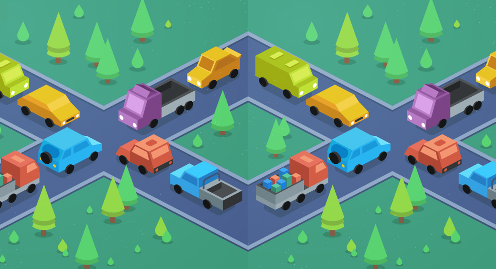

# 

<!-- ABOUT THE PROJECT -->
## About Concurrent Programs
~ This repo is still a work in progress ~

If you would like to check out the project and my concurrent programming notes, head over to my [blog post](http://erolgelbul.com/project-blog/concurrent-programs).

<!-- CONTRIBUTING -->
## Contributing

If you would like to add any extra features to the Logisim simulation, feel free to fork and create a pull request. Thank you!

1. Fork the Project
2. Create your Feature Branch (`git checkout -b feature/AmazingFeature`)
3. Commit your Changes (`git commit -m 'Add some AmazingFeature'`)
4. Push to the Branch (`git push origin feature/AmazingFeature`)
5. Open a Pull Request

(<a href="#top">back to top</a>)

<!-- CONTACT -->
## Contact

Erol Gelbul - [Website](erolgelbul.com) - erolgelbul@gmail.com

Project Link: [Concurrent Programs](https://github.com/ErolGelbul/concurrent_programs/)

(<a href="#top">back to top</a>)

